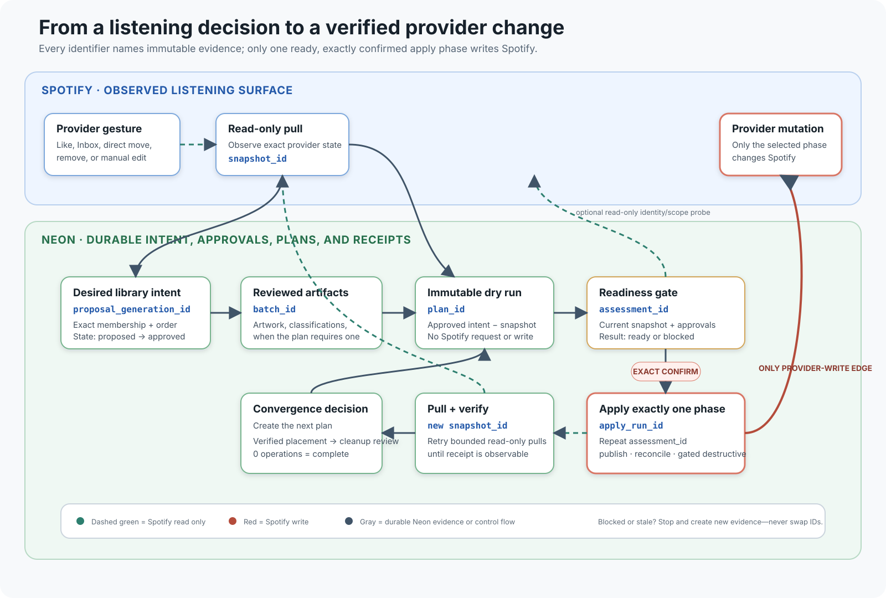

# From intent to verified execution

This is the plain-language map for the maintenance safety workflow retained on
the v0.2 development line. The released v0.1.4 tag remains the authority for
that installed binary; the capability handshake and explicit plan origin below
arrive with V020-11R on `main`.



## The central idea

Chordrift separates six questions that a typical music client combines:

1. **What did Spotify most recently show us?** A pull records an observation.
2. **What do I want?** A proposal records complete desired playlist intent.
3. **Did I approve every required supporting artifact?** A batch records one
   exact review set such as artwork or classifications.
4. **What would have to change?** A plan is an immutable diff; it performs no
   provider write.
5. **Is that exact diff still safe now?** A readiness assessment checks the
   current snapshot, approvals, permissions, integrity, retry, and replay.
6. **What actually happened?** An apply run records one bounded phase, and a
   later pull verifies what Spotify accepted.

Neon is the durable ledger for these objects. Recording intent, approvals,
plans, assessments, and receipts is an intentional Neon write, but it is not a
Spotify write. Spotify changes only at `sync apply`.

## Identifier glossary

| Identifier | What it identifies | Created by | Permission it grants |
| --- | --- | --- | --- |
| `snapshot_id` | One observed Spotify inventory at a point in time. | `sync pull` | None; it is evidence. |
| `proposal_generation_id` | One complete desired canonical playlist library, including exact membership and order. | Proposal generation/extension; manual decisions revise that generation | None until explicitly approved. |
| `batch_id` | One exact review set. The command context tells you whether it is artwork, classifications, cleanup, or another batch family. | The corresponding `import` or `plan` command | None until the matching approval command confirms the same ID. |
| `plan_id` | One immutable diff between an approved proposal and a particular observed snapshot. | `sync plan` | None; it is a dry run. |
| `assessment_id` | One readiness verdict for one exact plan at one moment. | `sync readiness` | A `ready` assessment can authorize one requested phase only when repeated as `--confirm`. |
| `apply_run_id` | The durable execution receipt and restart checkpoints for one applied phase. | `sync apply` | None; inspect and verify it. |
| `input_hash` | Content identity used to prove replay and reuse. | Most immutable commands | Normally informational; do not substitute it for an ID. |

IDs are deliberately not interchangeable. A plan ID cannot confirm an
assessment, and an artwork batch ID cannot approve a proposal. Repeating the
wrong kind of ID fails instead of guessing.

Every current maintenance plan also prints `plan_origin: maintenance`. Future
Spin publication plans must use a distinct `spin_publication` origin. Intake
and maintenance helpers reject every other origin before readiness or apply.

## What each command can change

| Command family | Neon | Spotify |
| --- | --- | --- |
| `sync pull` | Records/reuses current provider evidence and verifies pending runs. | Read-only requests. |
| `proposals assign`, `tracks exclude`, proposal approval | Records durable intent and revisions. | No request or write. |
| Artwork/classification import and approval | Records an exact reviewed batch and approval. | No request or write. |
| `sync plan`, `plan-show`, `apply-preflight` | Records/reuses an immutable plan or reads it. | No request or write. |
| `sync readiness --probe` | Records an immutable assessment. | One bounded read-only identity/scope probe. |
| `sync apply --phase …` | Records checkpoints and the execution receipt. | **Writes only the selected ready phase.** |
| Post-apply `sync pull` | Records the observed result and verification. | Read-only requests. |

## Why a plan can contain several phases

A single approved intent can require changes with different risks. The plan
keeps them together for review but `sync apply` executes only one named phase:

| Phase | Typical contents | Rule |
| --- | --- | --- |
| `publish` | Add/create destinations, replace approved order, upload approved artwork. | Establish the safe destination first. |
| `reconcile` | Record exclusions and remove tracks from superseded managed destinations. | Run only after reviewing provider drift and exact removals. |
| `cleanup` | Consume verified Inbox/Liked/Re-evaluate entries or approved external relationships. | Destructive and deferred until the destination is published and verified. |
| `retirement` | Remove a separately approved obsolete container relationship. | Destructive and separately approved. |

For a multi-phase plan, do not apply every phase from one old snapshot. Apply
one phase, pull and verify it, then create and assess the next plan from the new
snapshot. This prevents an earlier assessment from silently authorizing a
different provider state.

## The manual command loop

Observe and plan:

```console
$ chordrift sync pull --account personal
$ chordrift sync plan --account personal
$ chordrift sync plan-show --account personal --plan PLAN_ID --details
```

For a `publish` phase, validate local assets and request estimates. Then assess
the exact plan:

```console
$ chordrift sync apply-preflight --account personal --plan PLAN_ID
$ chordrift sync readiness --account personal --plan PLAN_ID --probe
```

Only a result that says `Apply readiness — ready` may proceed. Apply one phase
by repeating the assessment ID—not the plan ID:

```console
$ chordrift sync apply --account personal \
    --assessment ASSESSMENT_ID \
    --phase publish \
    --confirm ASSESSMENT_ID
```

Verify immediately:

```console
$ chordrift sync pull --account personal
$ chordrift sync apply-show --account personal --run APPLY_RUN_ID
$ chordrift sync plan --account personal
```

If the run remains `awaiting_pull`, the plan becomes stale, readiness blocks,
or the provider result differs, stop rather than substituting a newer ID or
repeating a write blindly.

## Convenience scripts

Before doing any work, current helpers require exact installed-binary
capabilities through `chordrift capabilities --require …`. They do not infer
support from `chordrift --version`; an older or partial binary fails closed.

For a routine single-phase plan, use:

```console
$ scripts/chordrift-workflow.sh --account personal
```

For one reviewed phase from a multi-phase plan, use:

```console
$ scripts/chordrift-plan-phase.sh \
    --account personal --plan PLAN_ID --phase publish
```

Both wrappers still display the plan/readiness evidence and require the exact
assessment ID interactively. They do not weaken the Rust safety gates. The
phase wrapper refuses `cleanup` and `retirement`; those remain deliberately
manual destructive workflows.

These commands are routed through the same Rust application facade being
developed for v0.2.0. Compatibility preserves their safety meanings and
operator outcomes, but does not require future clients to reproduce legacy
command spelling or shell internals.
